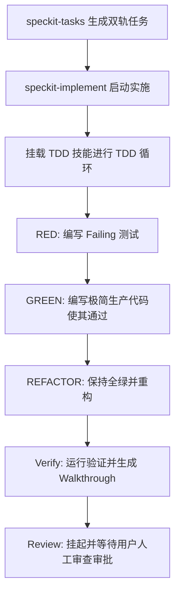

<!--
SYNC IMPACT REPORT:
- Version change: [CONSTITUTION_VERSION] -> 1.0.0
- List of modified principles:
  - [PRINCIPLE_1_NAME] -> 原则 I. 核心逻辑解耦与 API-First
  - [PRINCIPLE_2_NAME] -> 原则 II. 平台差异抽象与可打桩设计 (Mockability)
  - [PRINCIPLE_3_NAME] -> 原则 III. 测试驱动开发 (TDD 铁律)
  - [PRINCIPLE_4_NAME] -> 原则 IV. 多端安全防护与输入防御 (LAN Security & Input Defense)
- Added sections:
  - 1. 核心研发流程对齐 (Workflow Alignment)
  - 3. 智能体行为与权限限制 (Agent Constraints & Execution Fences)
  - 4. 层级化全链路追踪协议 (HTP) (Hierarchical Trace Protocol)
- Removed sections:
  - [PRINCIPLE_5_NAME]
- Templates requiring updates:
  - .specify/templates/plan-template.md (✅ updated)
  - .specify/templates/spec-template.md (✅ updated)
  - .specify/templates/tasks-template.md (✅ updated)
- Follow-up TODOs: None
-->

# PhoneMic Constitution

## 1. 核心研发流程对齐 (Workflow Alignment)

在项目的不同生命周期阶段，主/子智能体必须强制与特定的核心工程技能深度协同，实现规范化的阶段递进：

### 1.1 需求规约阶段 (Specify Stage)
* **命令重新解构**：`/speckit-specify` 与 `/brainstorming` 各自解耦独立使用。
* **需求脑暴**：使用 `/brainstorming` 进行代码上下文探查和探讨，与用户探讨对齐，并提供技术路线方案及优劣对比。在此期间，**绝对禁止**编写任何功能代码。
* **规约生成**：使用 `/speckit-specify` 自动生成规格说明书 `spec.md` 及质量自检表，并执行自动化质量校验。

### 1.2 编码实施阶段 (Implement Stage)
* **指令协同**：当用户触发 `/speckit-implement` 启动任务实施时，执行者（主或子智能体）必须与 `/test-driven-development` (TDD) 技能强力协同，将 TDD 作为核心执行引擎。
* **双轨驱动**：严格遵循 `RED (编写报错测试) -> GREEN (写极简代码使测试通过) -> REFACTOR (重构并保持全绿)` 的微循环来销掉 `tasks.md` 中的双轨待办项。



## 2. 核心研发原则 (Core Principles)

### 原则 I. 核心逻辑解耦与 API-First
* **说明**：Web 服务（FastAPI）、GUI 界面（PySide6）、系统控制（PyAutoGUI/pywin32/keyboard）逻辑必须高度解耦。不得将核心业务逻辑直接绑定在 GUI Event Handler 或 Web 路由处理中，所有核心功能必须可通过 API 或纯 Python 类独立调用并进行单元测试。

### 原则 II. 平台差异抽象与可打桩设计 (Mockability)
* **说明**：针对 Windows 原生 API（`pywin32`）或可能阻塞键盘的 `keyboard`、`pyautogui` 操作，必须使用抽象层进行包装，以保证测试可以在非 Windows/无 GUI 的容器环境（如 Linux 自动化测试环境）中通过打桩（Mock）正常全绿通过。

### 原则 III. 测试驱动开发 (TDD 铁律)
* **说明**：在编写任何功能代码或修复 Bug 前，**必须先有且仅有一个失败的测试用例**。若 Git 提交历史中没有对应的 Failing 测试（RED 阶段）记录，该段生产代码被视为违规代码。

### 原则 IV. 多端安全防护与输入防御 (LAN Security & Input Defense)
* **说明**：PhoneMic 运行于局域网且包含模拟系统按键 and 外部程序执行功能。系统对输入的解析、命令映射及外部程序调起必须包含严格的白名单校验，杜绝任何外部输入导致的安全提权或系统指令注入风险。

## 3. 智能体行为与权限限制 (Agent Constraints & Execution Fences)

> [!TIP]
> 智能体的具体运行期红线与分支/推送物理限制已在项目根目录的 [AGENTS.md](file:///home/coding/workspace/PhoneMic/AGENTS.md) 中配置为全局强绑定规则。本节供项目规划和审查时进行一致性校对。

### 3.1 主智能体 (Main Agent) 的“网关门锁”限制
* **严禁越权合并与推送**：主智能体在未获得用户在聊天窗口中明确的、包含“同意合并/推送/Merge/Push”等肯定动作指令前，**绝对禁止**执行任何分支合并（`git merge`）与向远程 `main` 或其他保护分支进行推送（`git push`）的操作。在开发或子智能体交付完毕后，主智能体应自动将当前的特性开发分支同步推送（`git push`）至远程仓库以做备份与评审展示。
* **强制评审展示**：在开发或子智能体交付完毕后，必须以 Markdown 格式完整呈现验证报告（`walkthrough.md`），重点展示单元测试通过率（Pytest 输出日志）及核心代码 Diff。

### 3.2 子智能体 (Subagent) 的“隔离开发舱”限制
* **工作空间与分支封禁**：子智能体只被授予在当前指派的特性分支内修改代码、执行本地验证和本地 Git Commit 的权限。
* **越权动作绝对禁止**：子智能体**绝对禁止**执行 `git checkout` 切换分支、`git merge` 合并分支、以及 `git push` 推送至远程仓库的操作。
* **无条件休眠与打报告**：子智能体在完成 `tasks.md` 中的所有任务、生成本地 `walkthrough.md` 验证文档并完成本地 commit 后，必须立即停止任何工具调用，通过 `send_message` 向主智能体报告。

## 4. 层级化全链路追踪协议 (HTP) (Hierarchical Trace Protocol)

**版本**: 1.1 (PhoneMic Custom Edition)  
**核心理念**: **Debuggable by Design** —— 调试能力是设计出来的，不是凑出来的。

### 4.1 核心公理
1. **无 ID 不执行 (No ID, No Execution)**: 任何逻辑入口（FastAPI 路由、WebSocket 连接、后台命令执行任务）必须首先进入一个追踪层级。
2. **无限层级追加 (Infinite Nesting)**: 采用点号（`.`）分隔的栈式 ID 结构，支持深度追踪。
3. **上下文自感知 (Context Awareness)**: 严禁手动层层传递 `req_id` 字符串，必须通过 `contextvars` 实现协程安全的自动获取。
4. **结构化审计 (Structured JSON)**: 所有日志必须是合法的 JSON 字符串，以确保 AI 助手与开发人员能够进行高信噪比的过滤分析。

### 4.2 Trace ID 规范与命名空间
格式定义：`{Root_ID}[.{Sub_Scope}_{Sub_ID}]...`
针对 PhoneMic 的常见命名空间：
* `conn_{Socket_FD/Client_IP}`: 手机端 WebSocket 连接会话。
* `msg_{Seq_ID}`: 手机端发送的语音文本消息。
* `cmd_{Command_Name}`: 匹配成功并执行的电脑端自定义命令。
* `sim_{Action_Type}`: 触发的系统按键模拟（如 PyAutoGUI/pywin32 操作）。

### 4.3 最佳实践示例 (结合 PhoneMic 场景)

#### 4.3.1 WebSocket 消息接入与处理
```python
async def handle_websocket_message(client_id: str, message: dict):
    # 1. 恢复或生成连接层级的 ID
    with logger.use_id("conn", client_id):
        logger.info("WEBSOCKET_MSG_RECEIVED", {"msg_len": len(message.get("text", ""))})
        try:
            # 2. 处理消息文本
            await process_incoming_text(message.get("text", ""))
        except Exception as e:
            logger.error("PROCESS_MSG_FAILED", error=e)
            raise
```

#### 4.3.2 语音命令执行与模拟按键
在处理命令匹配和执行时，自动追加子层级：
```python
async def execute_command(cmd_name: str, cmd_args: str):
    # 自动追加到当前会话 ID 之后，形成如: conn_192.168.1.10.msg_42.cmd_press_enter
    with logger.use_id("cmd", cmd_name):
        logger.info("COMMAND_EXECUTION_START", {"args": cmd_args})
        try:
            # 3. 模拟按键或运行程序
            await run_simulate_action(cmd_args)
        except Exception as e:
            logger.error("COMMAND_EXECUTION_FAILED", error=e)
            raise
```

## 5. 治理与修订规范 (Governance & Revision)

**Version**: 1.0.0 | **Ratified**: 2026-06-27 | **Last Amended**: 2026-06-27
