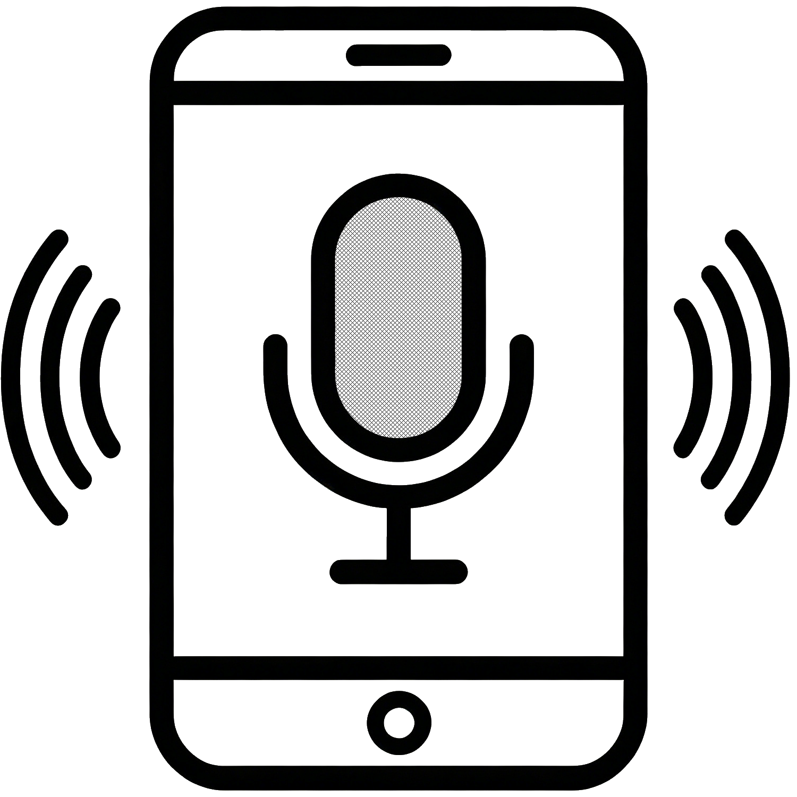

<div align="left">
  
</div>

# PhoneMic - 让手机成为电脑的语音输入终端

## 📖 简介

**当你的电脑没有麦克风，或者电脑自带的麦克风效果不佳时**，PhoneMic 可以帮你轻松解决语音输入问题。你只需用手机扫码，即可将手机上任意输入法（如豆包、讯飞、搜狗等）识别出的文字，实时发送到电脑当前光标位置。

简单来说，**PhoneMic 把手机变成电脑的“无线麦克风”**——手机负责拾音和语音识别，电脑负责接收文字并自动填入，让你在电脑上也能享受手机端成熟的语音输入体验。

**核心特性：**

- ✅ **无需安装 App** – 手机扫码即用，浏览器直接访问，不占手机空间
- ✅ **完美适配电脑无麦场景** – 电脑无需任何麦克风硬件，全靠手机端输入法完成语音转文字
- ✅ **实时预览** – 电脑悬浮窗实时显示输入内容，无焦点不干扰
- ✅ **自动发送** – 语音识别结束后自动上屏，流畅高效
- ✅ **语音命令** – 自定义文字触发模拟按键或运行外部程序
- ✅ **隐私安全** – 仅局域网传输，数据不经过任何云端服务器。请注意传输是明文的，请只在您信任的网络（如家庭或公司内网）使用，避免公共 WiFi。

## 🚀 快速开始

1. **下载安装**  
   从以下任一平台下载最新的 `PhoneMic_Setup.exe` 并运行安装：
   - [GitHub Releases](https://github.com/franj/PhoneMic/releases)
   - [Gitee Releases](https://gitee.com/franj/PhoneMic/releases)

2. **启动程序**  
   安装完成后，双击桌面图标或从开始菜单启动 PhoneMic。

3. **连接手机**  
   - 程序启动后，如果检测到多个 IP 地址，请选择手机所在网络的 IP。
   - 用手机相机扫描主界面上的二维码，手机浏览器会自动打开 PhoneMic 页面。
   - 当手机页面显示“已连接”时，即可开始使用。

4. **开始使用**  
   - 在手机输入框中输入文字（或使用语音输入），电脑悬浮窗会实时显示。
   - 默认自动发送模式：语音识别结束后文字自动上屏。
   - 如果发送的文本符合用户定义命令，会触发自定义动作，例如手机语音发送“确定”，电脑端会触发回车。
   - 您也可以在手机页面切换到手动发送模式，点击“发送”按钮上屏。

## 📦 安装方式

### 方式一：使用预编译安装包（推荐）

前往以下任一 Releases 页面下载 `PhoneMic_Setup.exe`：
- [GitHub Releases](https://github.com/franj/PhoneMic/releases)
- [Gitee Releases](https://gitee.com/franj/PhoneMic/releases)

### 方式二：从源码运行

```bash
# 克隆仓库（任选一个源）
git clone https://github.com/franj/PhoneMic.git
# 或
git clone https://gitee.com/franj/PhoneMic.git

cd phonemic

# 安装 Poetry（如未安装）
pip install poetry

# 安装依赖
poetry install

# 运行程序
poetry run python -m phonemic.PhoneMic
```

## 🛠 语音命令（扩展功能）

PhoneMic 支持自定义命令，在手机完成发送文本后，电脑将特定文字映射为模拟按键或运行外部程序。

- **打开命令管理**：主界面菜单栏 `工具 → 命令配置`，或右键系统托盘图标选择 `命令配置`。
- **新增命令**：点击“新增”，填写名称、匹配类型（完全/前缀）、匹配模式、动作类型（按键/程序）和动作参数。

**常用命令示例：**

| 你想实现的 | 匹配模式 | 动作参数 |
|------------|----------|----------|
| 说“确定”就按回车 | `确定` | `enter` |
| 说“清空”就全选再删除 | `清空` | `ctrl+a, delete` |
| 说“超级确定”就按 Ctrl+Enter | `超级确定` | `ctrl+enter` |
| 说“帮我收集今天股票涨停信息”运行 AutoHotkey 脚本 | `帮我收集今天股票涨停信息`（完全匹配） | `"C:\Program Files\AutoHotkey\AutoHotkey.exe" D:\scripts\collect_stocks.ahk` |
| 带参数运行脚本（前缀匹配） | `请记录待办 ` | `cmd /c echo {content} >> D:\todo.txt` |

**更多说明：**
- **按键序列**：支持组合键，如 `ctrl+a, delete`（先全选后删除），`ctrl+c, ctrl+v`（复制后粘贴）。
- **运行程序**：`calc`（打开计算器），`python D:\script.py {content}`（使用动态内容）。
- **占位符**：`{content}`、`{prefix}`、`{all_text}` 会被自动替换。
- **自定义工作目录**：在命令行前加 `{cwd:"绝对路径"}`，如 `{cwd:"D:\\work"} python run.py`。

所有命令立即生效，无需重启。

**进阶用户提示**：你可以直接编辑配置文件 `C:\Users\你的用户名\AppData\Local\PhoneMic\config\commands.json` 来批量管理命令。修改前请备份，并确保 JSON 格式正确（逗号、引号等）。

## 📄 许可证

本项目 (PhoneMic) 采用 **Apache 2.0** 许可证开源，详见 [LICENSE](LICENSE) 文件。

### 第三方依赖声明

本软件使用了以下开源组件：
- PySide6 (LGPL v3) – [主页](https://www.qt.io/qt-for-python)
- FastAPI (MIT) – [主页](https://fastapi.tiangolo.com)
- Uvicorn (BSD 3-Clause)
- PyWin32 (PSF License)
- PyAutoGUI (BSD 3-Clause)
- Pyperclip (BSD 3-Clause)
- netifaces (MIT)
- psutil (BSD 3-Clause)
- Jinja2 (BSD 3-Clause)
- keyboard (MIT)
- qrcode (BSD 3-Clause)
- Pillow (MIT)
- requests (Apache 2.0)

详细的版权和许可声明请参阅 [NOTICE.txt](NOTICE.txt) 文件。

根据 LGPL 协议要求，您可以替换 PySide6 的动态库文件，并获取 Qt 的完整源代码（见 `NOTICE.txt`）。

## 🤝 贡献

欢迎提交 Issue 和 Pull Request！请确保代码符合 PEP8 规范，并尽可能添加测试。

- [GitHub Issues](https://github.com/franj/PhoneMic/issues)
- [Gitee Issues](https://gitee.com/franj/PhoneMic/issues)

## 📧 联系方式

- 项目主页：
  - [GitHub](https://github.com/franj/PhoneMic)
  - [Gitee](https://gitee.com/franj/PhoneMic)
- 报告问题：
  - [GitHub Issues](https://github.com/franj/PhoneMic/issues)
  - [Gitee Issues](https://gitee.com/franj/PhoneMic/issues)

---

© 2026 PhoneMic 开发者