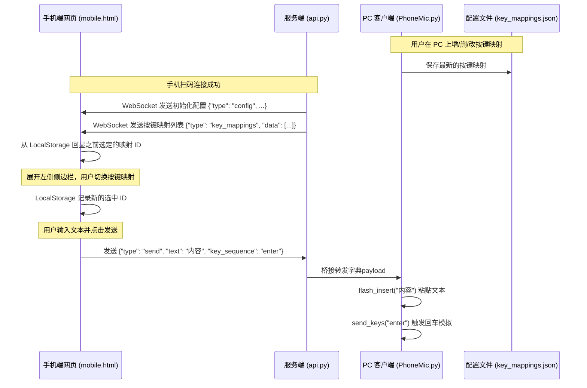

# 2026-06-28-key-mappings-design

## 1. 背景与目标
在用户使用 PhoneMic 进行手机端语音输入或打字发送到电脑上时，许多场景（如发送到聊天软件、命令行终端或输入框）需要在发送完文本后立即触发一些特定的控制按键（例如回车发送、Tab切换焦点等）。
本设计方案旨在引入“按键映射（Key Mappings）”机制：
* 用户可以在 PC 客户端管理常用的按键映射序列。
* 手机网页端扫码连接后，可以通过左侧可隐藏收缩栏（Drawer）中的下拉菜单选择当前生效的按键映射。
* 选中的按键映射自动保存在手机端本地（LocalStorage），以便下次扫码时自动记忆。
* 手机端发送时，会将映射内容与文本共同打包发往 PC，PC 端在光标粘贴完文本后立即触发对应的按键映射。

---

## 2. 系统架构与交互流程


---

## 3. 详细设计与代码修改点

### 3.1 配置文件与管理器 (`phonemic/utils/key_mappings_manager.py`) [NEW]
新建按键映射管理器（`KeyMappingsManager`），行为模仿已有的 `CommandsManager`：
* 单例实现 `KeyMappingsManager.instance()`。
* 配置文件为 `key_mappings.json`，在配置目录中生成。
* 提供默认项：
  * `"none"` -> `"无 (不追加)"` -> `""`
  * `"enter"` -> `"回车 (Enter)"` -> `"enter"`
  * `"tab"` -> `"制表符 (Tab)"` -> `"tab"`
* 提供读取 `get_mappings()`、修改 `update_mapping()`、添加 `add_mapping()` 和删除 `delete_mapping()` 方法。
* 定义信号 `mappings_changed`，便于配置变更时通知客户端和后端。

### 3.2 PC端配置管理界面 (`phonemic/gui/key_mappings_dialog.py`) [NEW]
* 创建 `KeyMappingsDialog`，采用与 `CommandsDialog` 类似的表单和列表。
* 显示三列：名称、按键序列（如 `enter`，`ctrl+s, enter`）、操作按钮（修改、删除）。
* 新增/修改弹窗（`KeyMappingEditDialog`）中，对按键序列输入框进行格式校验（直接复用 `phonemic/gui/keyboard.py` 中的 `validate_key_sequence` 函数）。

### 3.3 PC端主界面挂载 (`phonemic/gui/dashboard.py`) [MODIFY]
* 在 `_setup_menu` 中，在“设置”菜单下增加一个名为“按键映射 (Key Mappings)”的 Action：
  ```python
  key_mappings_action = QAction(self.i18n.tr("dashboard.menu_key_mapping"), self)
  key_mappings_action.triggered.connect(self._open_key_mappings_dialog)
  settings_menu.addAction(key_mappings_action)
  ```
* 新增 `_open_key_mappings_dialog` 槽函数拉起 `KeyMappingsDialog`。

### 3.4 后端托管与 WebSocket 数据交互 (`phonemic/server/api.py`) [MODIFY]
* 在 `ConnectionManager.connect(websocket)` 方法内，接受连接后立刻下发按键映射列表数据：
  ```python
  await websocket.send_json({
      "type": "key_mappings",
      "data": KeyMappingsManager.instance().get_mappings_dict()
  })
  ```
* 监听 `KeyMappingsManager` 的 `mappings_changed` 信号，在发生变化时向当前活跃的 WebSocket 广播最新的列表。
* 修改 `receive_loop` 对 `send` 事件的解析，如果 payload 中包含 `key_sequence` 字段，将其与 text 一同打包成字典发射到主进程：
  ```python
  # 原逻辑：self.bridge.emit(msg_type, text)
  # 新逻辑：
  if msg_type == "send":
      key_sequence = message.get("key_sequence", "")
      self.bridge.emit("send", {"text": text, "key_sequence": key_sequence})
  ```

### 3.5 PC端按键模拟逻辑 (`phonemic/PhoneMic.py`) [MODIFY]
* 在主程序事件循环中修改接收 `send` 事件分支的 payload 处理：
  ```python
  elif event_type == "send":
      # 兼容处理字典类型和旧版纯字符串
      if isinstance(payload, dict):
          text = payload.get("text", "")
          key_sequence = payload.get("key_sequence", "")
      else:
          text = payload
          key_sequence = ""
      
      if not command_interceptor.process_send_text(text):
          flash_insert(text)
          if key_sequence:
              from phonemic.gui.keyboard import send_keys
              send_keys(key_sequence)
      hud.hide()
  ```

### 3.6 手机端页面侧边栏与发送逻辑 (`phonemic/resources/mobile.html`) [MODIFY]
* **UI 布局**：
  * 在 `#app` 根容器内引入左侧抽屉容器 `#settings-drawer`，通过 `transform: translateX(-100%)` 实现隐藏，过渡动画设为 `transition: transform 0.3s ease`。
  * 引入半透明黑色背景遮罩 `#drawer-overlay`。
  * 输入框上方或聊天顶部标题栏增加“☰”按钮。
  * 当点击“☰”或在屏幕向右滑时，激活抽屉面板和遮罩。
* **侧边栏结构**：
  * 包含主下拉菜单 `#key-mapping-select` 及其它设置（如果有的话）。
* **WebSocket 与渲染交互**：
  * 网页 JS 监听 WebSocket 消息，遇到 `type: 'key_mappings'` 时重新清空并渲染 `#key-mapping-select` 中的 `<option>`。
  * 初始化渲染完毕后，从 `localStorage.getItem('selected_key_mapping')` 中读取上一次的选中 ID，并将其设为 `selected`。若没有则默认选择 `none`。
  * 用户更改 `#key-mapping-select` 的选中项时，将其 ID 保存进 `localStorage`。
* **发送流程**：
  * 发送按钮的点击事件中，获取当前选中的按键序列（即下拉菜单的 `value` 值，每个 option 的 value 设为其对应的 keys），随消息打包发送给 WebSocket：
    ```javascript
    ws.send(JSON.stringify({
        type: "send",
        text: textContent,
        key_sequence: document.getElementById('key-mapping-select').value
    }));
    ```

---

## 4. 国际化词条支持
为了确保多语言支持完整，在 `phonemic/resources/locales/*.json` 中分别新增以下键值对：
* `dashboard.menu_key_mapping` / `dashboard.menu_key_mapping_tip`
* `key_mappings.title` / `key_mappings.add` / `key_mappings.column_name` / `key_mappings.column_keys` 等

---

## 5. 验证与测试方案
* **单元测试**：
  * 对 `KeyMappingsManager` 的 CRUD 进行单元测试。
  * 对 `PhoneMic.py` 中 `on_backend_event` 的 `send` 分支进行打桩测试（Mock 模拟按键和剪贴板操作，验证当传入 payload 包含 `key_sequence` 时，`send_keys` 能够被正确触发）。
* **手动测试**：
  * 运行程序，在 PC 客户端添加一个按键映射 `Tab键` -> `tab`。
  * 手机端连接，确认展开侧边栏并选择该映射。
  * 聚焦到两个文本框的第一格，通过手机端发送文本，确认发送完后光标自动跳到了第二个输入框内。
