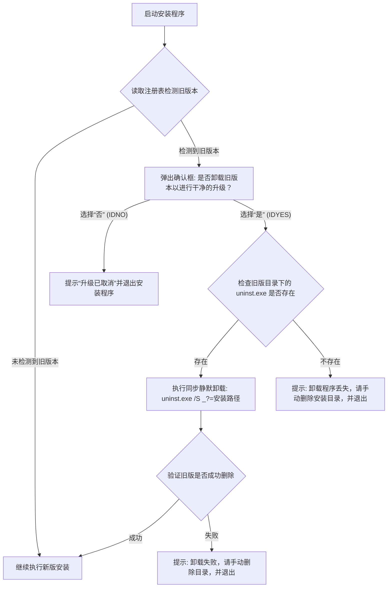

# 设计规格书：安装时自动检测并提示卸载旧版本

## 1. 目标与背景 (Goal & Background)
为了防止用户在安装新版本的 PhoneMic 时，因为直接覆盖旧版本导致冗余依赖文件残留（可能会引起打包后运行报错）或由于旧程序在后台运行导致安装失败，需要在安装程序启动时，自动检测系统是否已存在旧版本。

如果是升级安装，应当：
1. 弹出对话框提示用户。
2. 在用户确认后，自动调用旧版的卸载程序清空旧文件（同时保留用户的个人配置数据）。
3. 如果卸载程序丢失（极端情况），拦截安装并提示用户手动清理以确保安全。
4. 如果用户拒绝卸载，则取消安装，防止脏安装。

---

## 2. 详细设计 (Detailed Design)

### 2.1 注册表检测与路径定位
Windows 系统的安装和卸载信息在安装时通过以下注册表项写入：
* **注册表项路径**：`HKLM "Software\Microsoft\Windows\CurrentVersion\Uninstall\PhoneMic"`
* **安装路径读取**：`InstallLocation` (代表当前已安装旧版本的目录)
* **卸载命令行读取**：`UninstallString` (代表当前卸载程序路径，默认为 `"$INSTDIR\uninst.exe"`)

### 2.2 交互逻辑与状态流转



### 2.3 异常边界处理 (Edge Cases)

#### 场景 1：用户手动删除了安装目录下的 `uninst.exe`，但注册表仍有记录
* **处理方案**：通过 `IfFileExists` 检查 `$InstallLocation\uninst.exe`（如果为空则使用默认的 `$PROGRAMFILES\PhoneMic\uninst.exe`）。如果文件不存在，弹出以下警告：
  > “未找到旧版本的卸载程序（uninst.exe已丢失）。为防止升级冲突，请先手动删除安装目录：\n[路径]\n然后再重新运行安装程序。”
* **操作**：提示后直接调用 `Abort` 终止安装，避免强制覆盖。

#### 场景 2：卸载程序正在运行或卸载失败
* **处理方案**：使用 `ExecWait` 启动卸载，卸载结束后再次检测 `uninst.exe` 是否存在。如果依然存在，说明卸载未成功（如文件占用或权限不足），弹窗提示：
  > “旧版本卸载失败。请确保 PhoneMic 未在后台运行，或手动删除该目录后再试：\n[路径]”
* **操作**：提示后调用 `Abort` 终止安装。

#### 场景 3：如何确保不误删用户配置文件
* **原理确认**：根据 `phonemic/utils/paths.py` 的定义，用户的配置文件存放在 `%LOCALAPPDATA%\PhoneMic\config\settings.json` 中。
* **隔离设计**：旧版本的卸载脚本（由 `makesetup.nsi` 的 `Uninstall` section 定义）仅清理 `$INSTDIR`（通常为 `C:\Program Files\PhoneMic`）下的程序文件，**并不**触及用户的 `%LOCALAPPDATA%` 目录。因此，卸载旧版本能安全地保留用户的个人配置与按键映射。

---

## 3. NSIS 代码修改方案

在 `makesetup.nsi` 中，修改并扩展 `.onInit` 函数。

### 3.1 增加的伪代码逻辑
```nsis
Function .onInit
  # 1. 尝试读取注册表中的卸载命令行和安装目录
  ReadRegStr $R0 HKLM "Software\Microsoft\Windows\CurrentVersion\Uninstall\${APP_NAME}" "UninstallString"
  ReadRegStr $R1 HKLM "Software\Microsoft\Windows\CurrentVersion\Uninstall\${APP_NAME}" "InstallLocation"
  
  # 如果注册表无此项，说明未安装旧版本，直接跳过
  StrCmp $R0 "" noOldVersion
  
  # 2. 弹出确认提示框
  MessageBox MB_YESNO|MB_ICONQUESTION "检测到系统已安装 ${APP_NAME} 的旧版本。$\n$\n是否先自动卸载旧版本以进行干净的升级安装？$\n（注意：这不会删除您的个人配置文件及按键映射）" IDYES proceedUninstall
    # 用户选择“否”，终止安装
    MessageBox MB_OK|MB_ICONINFORMATION "升级安装已取消。"
    Abort
    
  proceedUninstall:
    # 3. 校验旧版卸载文件是否存在
    StrCmp $R1 "" useDefaultDir
    Goto checkUninst
  useDefaultDir:
    StrCpy $R1 "$PROGRAMFILES\${APP_NAME}"
    
  checkUninst:
    IfFileExists "$R1\uninst.exe" runUninstaller
      # 卸载程序丢失
      MessageBox MB_OK|MB_ICONSTOP "未找到旧版本的卸载程序（uninst.exe已丢失）。$\n$\n请先手动删除以下安装目录以清除旧版本，然后再重新运行安装：$\n$R1"
      Abort

  runUninstaller:
    # 4. 运行旧版本的静默卸载
    # 使用 _?=$R1 参数确保同步等待，防止异步执行冲突
    ExecWait '"$R1\uninst.exe" /S _?=$R1' $R2
    
    # 5. 校验卸载结果
    IfFileExists "$R1\uninst.exe" uninstallFailed
      Goto noOldVersion
      
  uninstallFailed:
    MessageBox MB_OK|MB_ICONSTOP "旧版本卸载失败。请确保 PhoneMic 未在后台运行，或手动删除该目录后再试：$\n$R1"
    Abort

  noOldVersion:
FunctionEnd
```

---

## 4. 验证方案 (Verification Plan)

### 4.1 手动验证测试用例
1. **全新安装测试**：在未安装过 PhoneMic 的干净机器上运行新版安装包，确认不会弹出任何提示并能顺利安装。
2. **正常升级测试**：
   - 先安装一个旧版本的 PhoneMic。
   - 运行新版安装包，验证是否能正确弹出确认框。
   - 点击“是”，验证是否自动清除了旧版本安装目录（且保留 `%LOCALAPPDATA%\PhoneMic\config\settings.json`）。
   - 确认新版本能成功安装，且旧的配置（如语言设置等）在启动新版后依然生效。
   - 点击“否”，验证安装是否终止且未改动系统文件。
3. **卸载器丢失测试**：
   - 安装旧版本，手动删除安装目录下的 `uninst.exe`，保留注册表项。
   - 运行新版安装包并选择“是”，验证是否能正确提示用户手动删除目录，并在提示后终止安装。
4. **程序运行中拦截测试**：
   - 运行旧版 `PhoneMic`，启动新版安装包进行升级。
   - 验证旧版卸载程序是否会提示关闭程序（因为旧版 `un.onInit` 中有进程检测逻辑），或验证安装包是否会提示卸载失败并退出。
