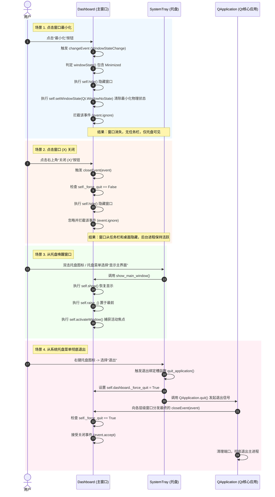

# Interface Contract: Dashboard & SystemTray 交互协议

本特性属于客户端进程内（In-Process）的两个 UI 核心类——主窗口（Dashboard）和系统托盘（SystemTray）之间的协作契约。

## 协作交互协议 (Interaction Protocol)

## 数据传输与交互契约说明

1. **Dashboard 变量依赖**：
   * `SystemTray` 必须持有 `Dashboard` 实例的强引用（在 `__init__(self, dashboard, icon_path)` 中传入）。
   * `SystemTray` 在调用退出生命周期时，对 `dashboard._force_quit` 进行属性修改的字段名称必须为 `_force_quit`，以与 `Dashboard` 类中重写的 `closeEvent` 判断严格对齐。
2. **事件忽略与还原约定**：
   * 所有在 `Dashboard` 中因为点击 (X) 或最小化被重定向为隐藏的行为，均必须显式调用 `event.ignore()` 阻止 Qt 平台继续向下游分发销毁/缩放事件。
   * 为了保证多端语音传输不因为界面可见度改变而被 Qt 消息循环挂起（Suspended），在隐藏主窗口后，底层的 WebSocket 连接和异步异步事件队列必须保持正常读写。
