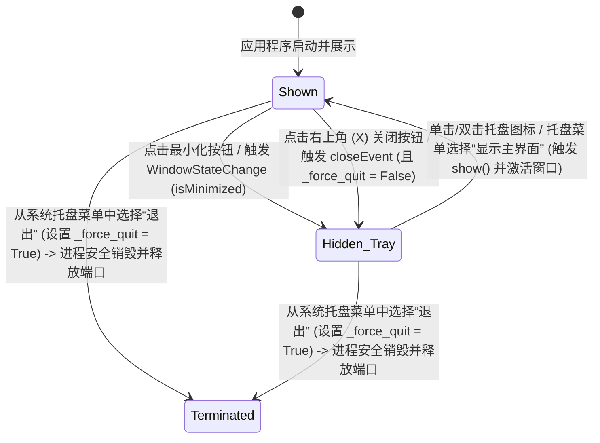

# Component State & Data Model: 窗口托盘管理

本特性不涉及关系型数据库或磁盘持久化存储的数据模型修改，而是包含图形界面组件生命周期状态管理相关的内存控制字段。

## 窗口与托盘组件的内部状态 (Memory State Schema)

### 1. 主窗口组件 `Dashboard` (QMainWindow)

主窗口将维护如下运行时属性，以便控制程序退出的流向和窗口渲染：

| 属性名称 (Attribute) | 数据类型 (Type) | 默认值 (Default) | 状态用途 (Purpose) |
| :--- | :--- | :--- | :--- |
| `_force_quit` | `bool` | `False` | 控制主窗口在关闭事件（`closeEvent`）分发时的处理流向。 • `False`：用户点击 (X)，拦截事件，仅 `hide()` 窗口。 • `True`：从托盘安全退出，接受事件并关闭。 |
| `connected` | `bool` | `False` | 语音客户端连接状态。 • 窗口在隐藏至系统托盘时，后台连接逻辑需要继续维持该状态。 |

---

### 2. 托盘组件 `SystemTray` (QObject)

系统托盘维护的上下文引用和生命周期管理属性：

| 属性名称 (Attribute) | 数据类型 (Type) | 描述 (Description) |
| :--- | :--- | :--- |
| `dashboard` | `Dashboard` | 对主窗口实例的引用。用于在点击“显示主界面”时唤醒主窗口，以及在选择“退出”时修改 `dashboard._force_quit` 为 `True`。 |
| `tray_icon` | `QSystemTrayIcon` | Qt 原生的托盘图标系统组件。 |

---

## 窗口状态转换图 (Window State Lifecycle)

主窗口 `Dashboard` 窗口的可见性和退出生命周期在内存中的状态迁移：

