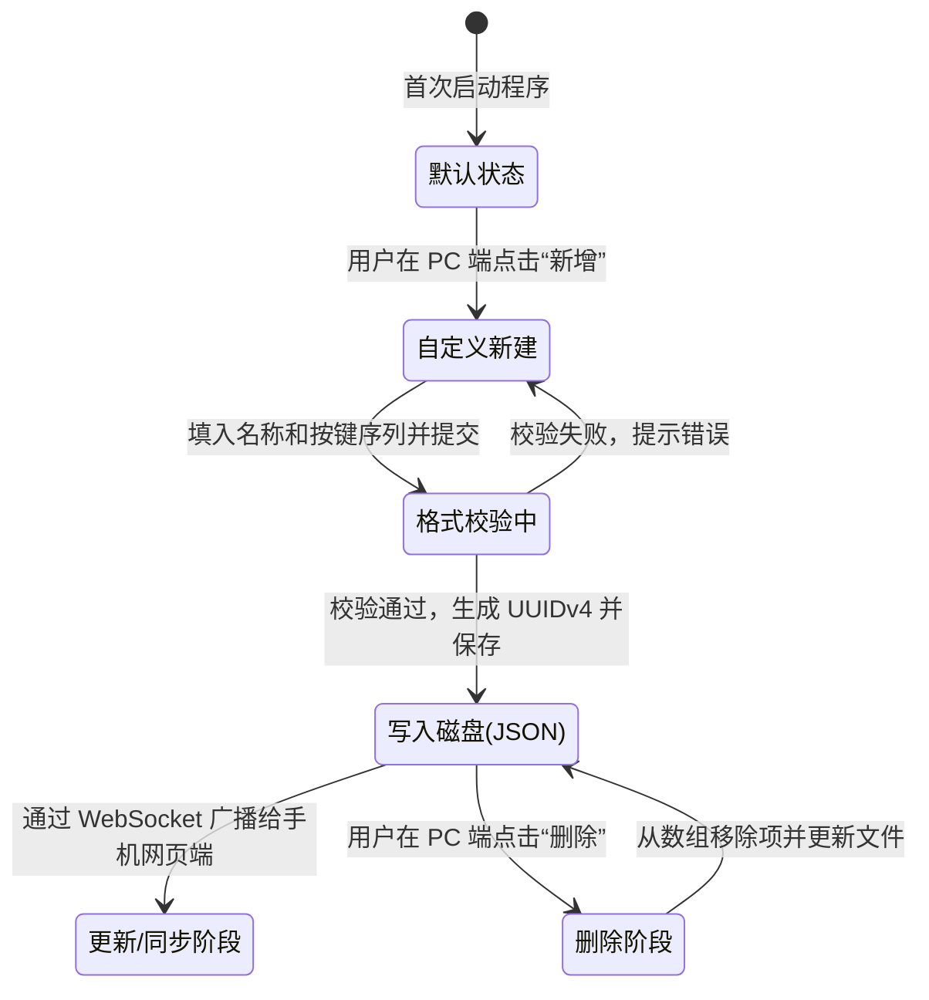

# Data Model: 按键映射数据结构

## 1. KeyMapping 实体定义

| 字段名 (Field) | 数据类型 (Type) | 是否必填 | 校验规则 / 约束 (Constraints) | 说明 (Description) |
| :--- | :--- | :--- | :--- | :--- |
| `id` | String | 是 | 必须为 `"none"` 或符合 UUIDv4 格式 | 唯一标识符。`"none"` 代表不追加。 |
| `name` | String | 是 | 长度为 1-12 字符，全局唯一，不可重名 | 供用户在界面（PC 端管理、手机端下拉框）中识别的友好名称。 |
| `keys` | String | 是 | 字符格式符合 `keyboard.py` 校验，长度上限 100 字符 | 实际被触发模拟的按键序列（以逗号分隔，键与键用加号连接，如 `ctrl+a, delete`）。当 id 为 `"none"` 时，keys 必须为空字符串。 |

---

## 2. 配置文件持久化格式

本特性不引入单独的数据库文件，所有的按键映射条目将直接作为数组，持久化保存在 PC 客户端的 `settings.json` 中，字段名为 `"key_mappings"`。

在 `settings.json` 中的示例：
```json
{
  "hud_timeout_sec": 5,
  "hud_font_size": 14,
  "hud_escape_enabled": true,
  "mobile_max_records": 10,
  "language": "zh_CN",
  "key_mappings": [
    {
      "id": "none",
      "name": "无 (不追加)",
      "keys": ""
    },
    {
      "id": "a90f7bdf-1b8f-4cb1-8fe7-fb8db2fa3200",
      "name": "回车 (Enter)",
      "keys": "enter"
    },
    {
      "id": "cb1c7df0-20cf-4688-bc1c-a96d2ff0fa01",
      "name": "制表符 (Tab)",
      "keys": "tab"
    }
  ]
}
```

---

## 3. 实体状态转换与生命周期

