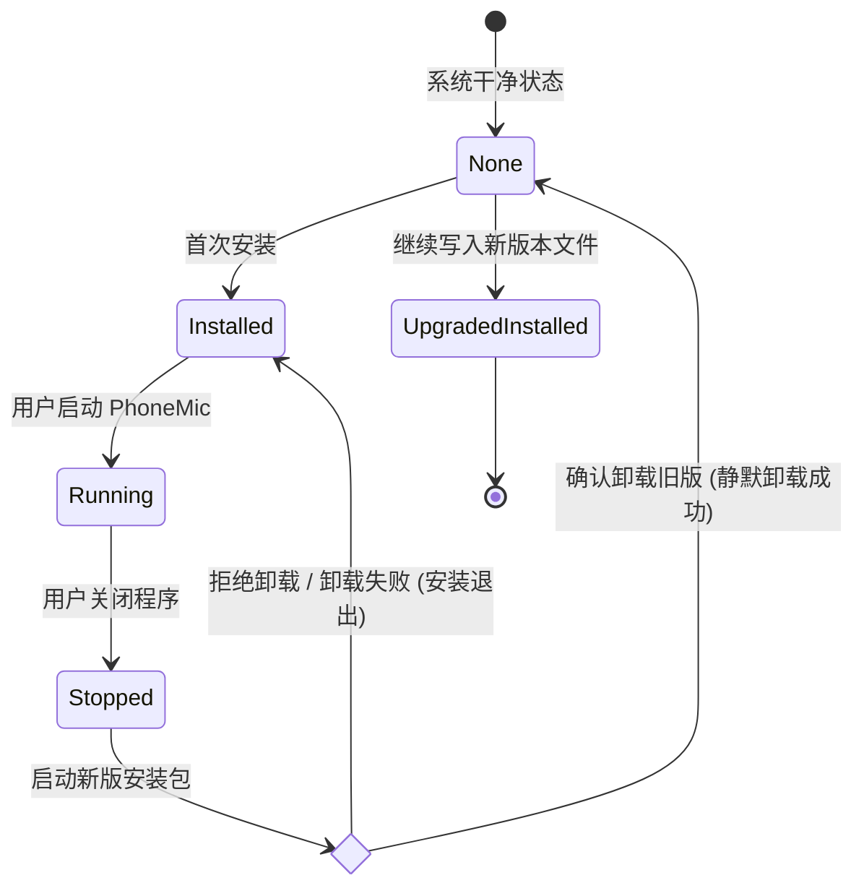

# Data & Domain Model: 安装时自动检测并提示卸载旧版本

本特性不涉及传统关系型数据库或应用内实体数据建模，但涉及 **Windows 系统级实体（注册表、文件系统、进程）** 及其状态流转。

## 1. 系统实体定义 (System Entities)

### 1.1 安装注册表项 (Registry Entry)
* **主键**：`HKLM\Software\Microsoft\Windows\CurrentVersion\Uninstall\PhoneMic`
* **属性列表**：
  * `UninstallString` (String)：指向旧版卸载程序的完整路径。通常是 `"$INSTDIR\uninst.exe"`。
  * `InstallLocation` (String)：旧版 PhoneMic 安装的绝对物理路径。
  * `DisplayVersion` (String)：旧版的版本号。

### 1.2 安装物理目录 (Installation Directory)
* **路径**：`$INSTDIR`（默认指向 `C:\Program Files\PhoneMic`，或从注册表 `InstallLocation` 读取）。
* **关键内容**：
  * `PhoneMic.exe`：主程序执行文件。
  * `uninst.exe`：卸载器执行文件。
  * `*.*`：其他打包的 Nuitka 依赖库和资源文件。

### 1.3 配置文件目录 (User Configuration)
* **路径**：`%LOCALAPPDATA%\PhoneMic\config\` (即 `C:\Users\<Username>\AppData\Local\PhoneMic\config\`)。
* **包含文件**：
  * `settings.json`：用户配置。
  * `commands.json`：自定义按键映射。
* **规则**：**禁止删除**。此目录独立于安装目录，不在旧版卸载清理范围之内。

---

## 2. 状态生命周期 (State Lifecycle)

应用安装状态的转换模型如下：

### 状态说明：
* **None (无程序)**：系统注册表无 PhoneMic 项，且安装目录为空。
* **Installed (已安装旧版)**：注册表存在记录，且安装目录存在 `uninst.exe`。
* **Running (运行中)**：PhoneMic 窗口句柄处于激活状态，进程被占用。
* **UpgradedInstalled (已成功升级)**：旧版本已被干净清除，新版本文件已写入。
