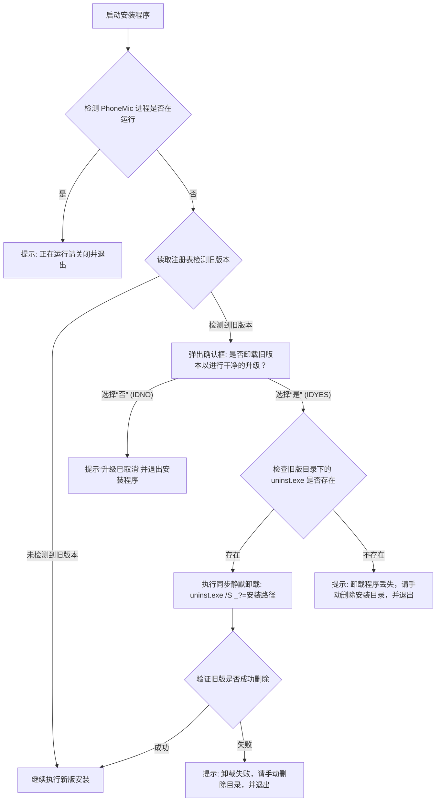

# Feature Specification: 安装时自动检测并提示卸载旧版本

**Feature Branch**: `005-auto-uninstall-old-version`

**Created**: 2026-07-01

**Status**: Draft

**Input**: User description: "安装时自动检测并提示卸载旧版本，如果用户手动删除了安装目录下的 Uninstall.exe 的话就截断提示用户去删除哪个文件或怎么做。并且保留用户的配置不被卸载"

## Clarifications

### Session 2026-07-01

- Q: 关于 PhoneMic 运行中进程的检测时机 → A: 一启动就由新版安装程序前置拦截运行中的进程，并提示用户关闭后退出（单次弹窗）。
- Q: 关于安装程序弹窗提示的多语言支持 → A: 直接写死中文。在安装包的所有弹窗中均只使用简体中文提示。

## User Scenarios & Testing *(mandatory)*

### User Story 1 - 正常升级覆盖安装 (Priority: P1)

用户启动新版本安装程序，程序检测到系统已安装旧版本，弹窗提示用户确认卸载并升级。用户点击“是”，程序同步静默运行旧版本的卸载程序（保留个人配置），成功清空旧版本后顺利安装新版本。

**Why this priority**: 这是最主要的升级工作流，保证新旧版本交替时文件不会冲突，且用户升级体验平滑。

**Independent Test**: 先安装旧版 PhoneMic，然后运行新版安装程序，弹窗选择“是”，最终安装完成且新旧程序无冲突，用户以前的配置依然生效。

**Acceptance Scenarios**:

1. **Given** 系统中已安装旧版 PhoneMic，且程序未在后台运行，**When** 启动新版安装程序并检测到旧版，**Then** 弹出确认对话框提示用户。
2. **Given** 弹出确认提示框，**When** 用户点击“是”且 `uninst.exe` 存在，**Then** 执行静默卸载并等待其完成，新版安装程序继续并成功安装新版，且用户的 `%LOCALAPPDATA%\PhoneMic\config\settings.json` 被完好保留。

---

### User Story 2 - 拒绝卸载升级 (Priority: P2)

用户运行新版安装程序，弹窗提示卸载旧版本时，用户选择“否”（取消卸载）。安装程序随即弹窗提示升级已取消，并安全退出安装程序。

**Why this priority**: 允许用户反悔，并且避免不卸载旧版强行覆盖带来的系统文件污染与运行时错误。

**Independent Test**: 运行新版安装程序，检测到旧版提示时点击“否”，验证安装程序是否中断退出且未修改任何旧文件。

**Acceptance Scenarios**:

1. **Given** 弹出确认卸载提示框，**When** 用户点击“否”，**Then** 提示“升级安装已取消”并退出当前安装程序。

---

### User Story 3 - 卸载程序丢失处理 (Priority: P3)

用户删除了安装目录下的 `uninst.exe`，但注册表中旧版的安装记录依然存在。用户运行新版安装包，选择“是”开始卸载。程序发现 `uninst.exe` 丢失，弹出明确的截断提示，告知用户应手动删除该目录，然后退出安装。

**Why this priority**: 极端情况下的安全保护机制，避免在缺少卸载器时执行错误或直接强行覆盖导致依赖冲突。

**Independent Test**: 安装旧版后，手动删掉旧版安装目录下的 `uninst.exe`，然后运行新版并确认升级，检查是否弹出手动删除指示窗口并中断退出。

**Acceptance Scenarios**:

1. **Given** 用户点击“是”升级且注册表记录的 `InstallLocation\uninst.exe` 丢失，**When** 安装程序执行检查，**Then** 弹出警告窗口提示“未找到旧版本的卸载程序（uninst.exe已丢失）。请先手动删除以下安装目录...”，然后调用 `Abort` 退出安装。

---

### User Story 4 - 运行中进程前置拦截 (Priority: P1)

当用户运行新版安装包时，如果系统后台正有旧版的 `PhoneMic.exe` 进程在运行，新版安装程序应该立即检测到并进行阻断。

**Why this priority**: 避免旧文件被占用导致覆盖或卸载失败，且前置单次弹窗提示比调用旧卸载器失败后再次报错的双重弹窗体验更好。

**Independent Test**: 保持旧版 PhoneMic 处于运行状态，直接运行新版安装包，验证是否在一启动时就弹出“请先关闭程序再运行安装程序”的窗口并安全退出。

**Acceptance Scenarios**:

1. **Given** 旧版 PhoneMic 处于运行状态，**When** 用户启动新版安装程序，**Then** 弹出警告提示用户“检测到 PhoneMic 正在运行，请先关闭程序再进行安装。”
2. **Given** 弹出警告提示，**When** 用户点击确定，**Then** 安装程序调用 `Abort` 退出。

### Edge Cases

- **卸载失败**：如果旧版卸载器在运行过程中因为文件占用等原因未完全将自己删除（或 `uninst.exe` 依然存在），安装程序应弹出提示“旧版本卸载失败。请确保 PhoneMic 未在后台运行，或手动删除该目录后再试”，并中断退出。
- **注册表损坏/未设置 `InstallLocation`**：如果注册表中 `InstallLocation` 为空而 `UninstallString` 存在，安装程序应能够从 `UninstallString` 解析或退回到默认的 `$PROGRAMFILES\PhoneMic` 去检查 `uninst.exe`。

## 2.2 交互逻辑与状态流转

## Requirements *(mandatory)*

### Functional Requirements

- **FR-001**: 安装程序必须在启动最开始（`.onInit`）检测 `PhoneMic` 进程是否正在运行，如在运行则弹出提示并调用 `Abort` 退出。
- **FR-002**: 安装程序必须在启动（`.onInit`）检测进程通过后，读取注册表 `HKLM "Software\Microsoft\Windows\CurrentVersion\Uninstall\PhoneMic"` 检测是否已安装旧版本。
- **FR-003**: 若检测到旧版本，必须弹出 `MB_YESNO` 类型的对话框询问用户是否卸载旧版本并升级。
- **FR-004**: 用户若选择“否”，安装程序 must 立刻调用 `Abort` 退出。
- **FR-005**: 用户若选择“是”，安装程序必须首先校验旧版安装路径下 `uninst.exe` 是否存在。如果不存在，必须弹出警告弹窗指引用户手动删除安装目录，随后 `Abort` 退出。
- **FR-006**: 如果 `uninst.exe` 存在，必须同步执行静默卸载命令 `uninst.exe /S _?=$INSTDIR` 并等待其完成。
- **FR-007**: 卸载执行完后，安装程序必须再次确认 `uninst.exe` 是否已被删除。如果仍存在，必须提示卸载失败并退出。
- **FR-008**: 整个卸载和覆盖过程不得删除或破坏用户在 `%LOCALAPPDATA%\PhoneMic\config\settings.json` 下的配置文件。
- **FR-009**: 安装和卸载过程中的所有交互和弹窗均使用写死的简体中文显示。

## Success Criteria *(mandatory)*

### Measurable Outcomes

- **SC-001**: 正常升级情况下，从用户点击“是”到旧版本卸载完成、新版本安装开始，中间不出现冗余的文件冲突报错。
- **SC-002**: 整个卸载升级流程中，用户以前设置的配置项（如语言等）在新版本安装并运行后 100% 被保留并能成功读取。
- **SC-003**: 卸载器丢失的极端情况下，安装程序 100% 能够拦截安装并给出具体路径的手动删除指引，不发生默默覆盖或报错崩溃。
- **SC-004**: 进程运行中的情况下，安装程序 100% 能前置拦截，提示仅显示一次，不出现因调用卸载器报错而导致的二次提示。

## Assumptions

- 用户已安装的旧版本是通过标准的 `makesetup.nsi` 打包而成的，且注册表中有对应的卸载项。
- 用户的配置文件在旧版本中也是保存在 `%LOCALAPPDATA%` 中，不会保存在程序的安装目录 `$INSTDIR` 中（根据 paths.py 源码，目前这符合事实）。
